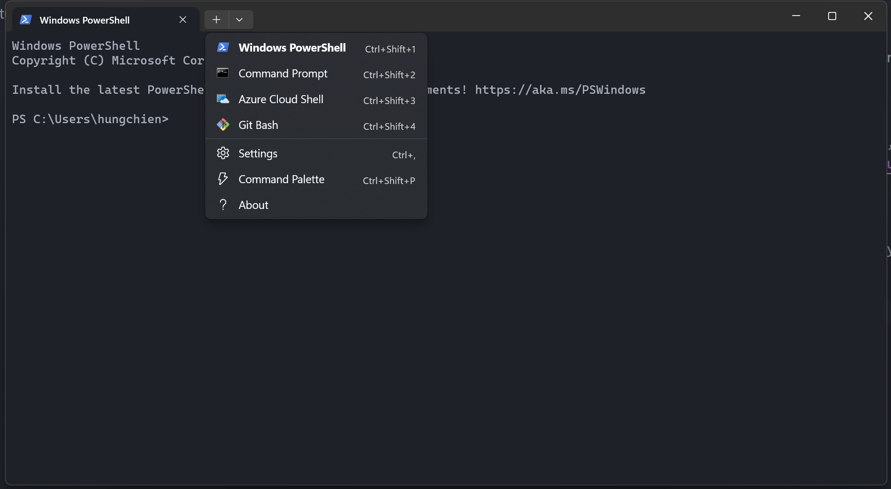

# Introduction
This is a tutorial for group members who are not familiar with Git, GitHub, and modules in Python and it will guide you through the process of creating a new module and adding it to the project.

# Git and GitHub
I here only show you the basic commands that you need to clone this project, create a new branch, and push your changes to GitHub. For more information, please refer to [this video](https://www.youtube.com/watch?v=RGOj5yH7evk). Before you start, please make sure that you have installed Git on your computer and authenticated your GitHub account. If you have not done so, please refer to [Github documentation](https://docs.github.com/en/get-started/quickstart/set-up-git). Besides, you are recommended to use Git Bash to run the following commands and installing Windows Terminal helps you to manage multiple command line profiles.



## Clone the project
First, you need to clone the project to your local computer. To do so, you need to open a command line window and run the following command:

```bash
git clone https://github.com/Peterhungchien/SDA_Project.git
```
or you can use SSH instead of HTTPS:

```bash
git clone git@github.com:Peterhungchien/SDA_Project.git
```

## Create a new branch
After cloning the project, you need to create a new branch to work on. To do so, you need to run the following command:

```bash
git checkout -b <branch_name> # type your branch name instead of <branch_name>
```

After creating a new branch, you automatically switch to that branch. You can check the current branch by running the following command:

```bash
git branch
```

Now you can start working on your branch. Any changes you make are local and will not affect the main branch.

## Commit and Push Your Changes
Let us say you create a Python script `my_script.py` in the `tutorial` folder. After you finish your work, you need to commit your changes and push them to GitHub. To do so, you need to run the following commands:

```bash
git add tutorial/my_script.py # add your script to the staging area
git commit -m "Add my_script.py" # commit your changes
```

As the command name "commit" suggests, you have now committed your changes to your local repository. To push your changes to GitHub, you need to run the following command:

```bash
git push origin <branch_name> # push your changes to GitHub
```

After this, there will be a new branch on GitHub with the same name as your local branch. You'll see a message indicating that you've recently pushed a new branch. Click on the "Compare & pull request" button next to this message. You can now create a pull request to merge your changes into the main branch. On the next page, review your changes and fill in the title and description for the pull request. After your pull request is approved, your changes will be merged into the main branch.

Once your pull request is accepted, you can delete your branch. To do so, you need to run the following command:

```bash
git checkout main # switch to the main branch
git branch -d <branch_name> # delete your branch
git push origin --delete <branch_name> # delete your branch on GitHub
```

## Update Your Local Repository
After your pull request is accepted, you need to update your local repository. To do so, you need to run the following commands:

```bash
git checkout main # switch to the main branch
git fetch origin # fetch the latest changes from GitHub
git merge origin/main # merge the latest changes into your local repository
```

Now your local repository is up-to-date and you can create a new branch to work on.

# Modules in Python
The very first question: what is a module? In Python, every `.py` file is a module and has its own namespace. A module can contain arbitrary objects, such as classes, functions, and variables. You can access the objects in a module by using the dot operator. For example, if you have a module `my_module.py` that contains a function `my_function`, you can access this function by using the following code:

```python
import my_module
my_module.my_function()
```

For a more comprehensive introduction to modules in Python, please refer to [Python documentation](https://docs.python.org/3/tutorial/modules.html) and [this article](https://realpython.com/python-modules-packages/).

Next question is why we need to create a module. The answer is simple: to make our code more readable, reusable and more organized. For example, if you have a Python script that contains a function `my_function`, you can create a module `my_module.py` and put this function in it. Then you can import this module and use this function in other scripts. This is a very simple example but it shows the basic idea of modules. Imagine otherwise you have a Python script that contains hundreds of functions and variables, it will be very difficult to read and maintain. Therefore, it is always a good idea to create a module for your project. (And you can see how important functions are in Python, which also enhances the reusability of your code and avoids variable name conflicts.)

Let us take a look at how modules can facilitate development of our project. A machine learning project is usually composed of several steps, such as data preprocessing, model training, and model evaluation. Each step can be implemented in a separate module. For example, you can create a module `preprocessing.py` that contains functions for data preprocessing and a module `model.py` that contains functions for model training and evaluation. Then you can import these modules and use the functions in them in your main script. This makes your code more readable and organized. It also boosts collaboration because different group members can work on different modules at the same time. If the library name is `SDAproject`, we will have a file structure like this:

```bash
SDAproject/
    __init__.py
    preprocessing.py
    model.py
scripts/
    main.py
```

Wait, what is `__init__.py`? It is a special file that tells Python that this directory is a Python package. For more information, please refer to [Python documentation](https://docs.python.org/3/tutorial/modules.html#packages). In this example, it contains the following code:

```python
from . import preprocess
from . import model
```

And we can call the functions in `preprocessing.py` and `model.py` in `main.py` by using the following code:

```python
from SDAproject import preprocessing, model
```

## One File is Far from Enough...
In the previous section, we have seen how modules can facilitate development of our project. However, suppose you want to define several utility functions to help preprocess the data and do not want to put them in `preprocessing.py`, what should you do? In this case, you can create a directory under `SDAproject` named `preprocessing` and put the helper function in `utils.py` under this subdirectory. 
The file structure will be like this:

```bash
SDAproject/
    __init__.py
    preprocessing.py
    model.py
    preprocessing/
        __init__.py
        utils.py
        preprocessing.py
scripts/
    main.py
```

Now you can import the helper function in `utils.py` into `preprocessing.py` by using the following code in `preprocessing.py`:

```python
from .utils import helper_function
```

And in `SDAproject/preprocessing/__init__.py` we have:

```python
from .preprocessing import *
# from .utils import * # you can also import the helper function here
```

Now, if we want to use our library in `scripts/main.py`, we can use the following code:

```python
import sys
sys.path.append('../') # add the parent directory to the search path
```

I have already uploaded a sample project under this directory. Play with it to see if you can understand how it works!